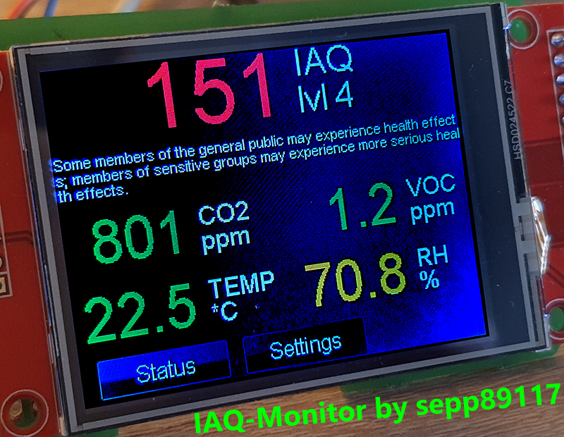

# IAQ_Monitor
IAQ Monitor (traffic light) with Teensy 4, BME68x sensor and ILI9341 LCD

Approximate cost of the project: 70 US-Dollar or 60 Euro

# Features
<b>The IAQ monitor displays the following values:</b>
- IAQ index
  - IAQ level
  - An evaluation of the IAQ as text
- eCO2 value [ppm]
- eVOC value [ppm]
- temperature [°C or Fahrenheit]
- relative humidity [%rH]

The values are shown in color depending on their level of concern. It is recommended to ventilate when the IAQ is red.

<b>More values:</b>
- Pressure [hPa]
- Altitude [m]
- Absolute humidity [g/m³]
- Dewpoint [°C or Fahrenheit]
- Air density [kg/m³]

<b>Settings:</b>
- Set temperature offset for BME68x
- Enable/disable darkmode for ui
- Switch between Celsius and Fahrenheit
- Calibrate touch

<b>Status display</b>
- Shows iaqAccuracy from BME68x
  - Shows evaluation of the iaqAccuracy as text
- Displays the status of BSEC and BME68x

# Usage
Install the following libs:
- Teensy_UI-Lib (https://github.com/sepp89117/Teensy_UI)
- ILI9341_t3n-Lib from KurtE (https://github.com/KurtE/ILI9341_t3n)
- Bosch BSEC-Lib (https://github.com/BoschSensortec/BSEC-Arduino-library or from Library-Manager in Arduino [BSEC])
- Copy the extension for Cortex-M7 (https://www.bosch-sensortec.com/software-tools/software/bsec/) to ``BSEC_Software_Library\src\``-Folder

You have to change the "platform.txt" to "C:\Program Files (x86)\Arduino\hardware\teensy\avr\platform.txt" in order to be able to use the BSEC-Lib. The path may differ for your installation. Do:
1. Add ``compiler.libraries.ldflags=`` under ``compiler.elf2hex.flags=-O ihex -R .eeprom`` (For Teensyduino 1.8.5 it is under line 8)
2. Add the Path to ``Cortex_M7\libalgobsec.a`` the line under ``##Link`` like: ``recipe.c.combine.pattern="{compiler.path}{build.toolchain}{build.command.linker}" {build.flags.optimize} {build.flags.ld} {build.flags.ldspecs} {build.flags.cpu} -o "{build.path}/{build.project_name}.elf" {object_files} "{build.path}/{archive_file}" "C:\Users\[USERNAME]\Documents\Arduino\libraries\BSEC_Software_Library\src\Cortex_M7\libalgobsec.a" "-L{build.path}" {build.flags.libs}``
- Make sure that the path or ``[USERNAME]`` for your installation is correct..

<b>Final steps</b>
- Connet the TFT and the BME to your Teensy
- Set the value of ``float tempOffset = 0.9f;`` appropriate to your sensor.
- Upload the sketch
- Have fun
